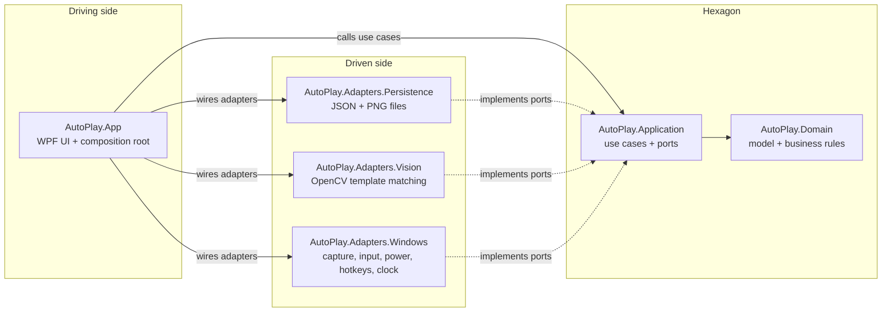

# AutoPlay — Architecture

AutoPlay follows a **hexagonal architecture** (ports and adapters). The business logic sits at the
center and depends on nothing technical; the user interface, the file system, OpenCV and Win32 are
plugged in from the outside through interfaces called **ports**.

## Layers

| Project | Role | May depend on |
|---|---|---|
| `AutoPlay.Domain` | Entities and value objects (`Profile`, `Screen`, `Location`, `Sequence`, geometry, `RawImage`) and pure business rules (coordinate scaling, rectangle editing, screen and sequence validation). | Nothing (base library only). |
| `AutoPlay.Application` | **Use cases** (`UseCases/`), the sequence engine (`Execution/SequenceRunner`) and the **driven ports** (`Ports/`) the use cases need. | Domain only, no package. |
| `AutoPlay.Adapters.Persistence` | Implements the persistence ports with JSON and PNG files; translates I/O errors into `PersistenceException`. | Application (and OpenCvSharp for PNG). |
| `AutoPlay.Adapters.Vision` | Implements `ITemplateMatcher` with OpenCV. | Application (and OpenCvSharp). |
| `AutoPlay.Adapters.Windows` | Implements `IScreenCapture` (GDI), `IInputDriver` (`SendInput`), `IPowerManager` (power requests) and `IClock`; also provides the global hotkey and window geometry helpers used by the UI. | Application. |
| `AutoPlay.App` | **Driving adapter**: WPF views and view models that call the use cases. Also the **composition root** (`App.xaml.cs`), the only place that knows the concrete adapters. | Everything. |

## Ports

**Driving ports** — what the UI can ask the application to do (`AutoPlay.Application/UseCases`):

| Use case class | Responsibilities |
|---|---|
| `ProfileService` | List, create (name rules) and delete profiles; remember the last target region. |
| `ScreenService` | Capture a target region, save a screen (validation, template cropping), list the sequences using a screen, delete, read captures and templates. |
| `SequenceService` | Save a sequence (validation against screens and other sequences), duplicate, delete, list. |
| `SequenceExecutionService` | Prepare a run (checks and template loading), save the capture of a failed verification. |
| `SequenceRunner` | Execute a sequence (delays, verification, clicks, pause, stop, resume). |

Use cases return an `OperationResult` when a request can be refused (validation or storage error), so
the UI only has to display the messages.

**Driven ports** — what the application needs from the outside world (`AutoPlay.Application/Ports`):

| Port | Adapter |
|---|---|
| `IProfileRepository`, `IScreenRepository`, `ISequenceRepository`, `IRunLogStore` | `FileProfileStore` (Persistence) |
| `ITemplateMatcher` | `OpenCvTemplateMatcher` (Vision) |
| `IScreenCapture` | `GdiScreenCapture` (Windows) |
| `IInputDriver` | `SendInputDriver` (Windows) |
| `IPowerManager` | `WindowsPowerManager` (Windows) |
| `IClock` | `SystemClock` (Windows) |

Adapters report storage failures as `PersistenceException`, defined next to the ports, so the
application never depends on file-system, JSON or image exceptions.

## Dependency rules

1. The Domain depends on nothing.
2. The Application depends only on the Domain and uses no third-party package.
3. An adapter depends on the Application (and the Domain), never on another adapter or on the App.
4. Only the App references the adapters, to wire them in the composition root.

These rules are enforced by `tests/AutoPlay.ArchitectureTests`, which checks the project references
of every project and the assemblies actually used by the cross-platform ones. A change that breaks a
rule makes the build fail in CI.

## Tests

| Project | Scope |
|---|---|
| `AutoPlay.Domain.Tests` | Business rules, without any fake. |
| `AutoPlay.Application.Tests` | Use cases and sequence engine, with in-memory fakes of the ports (`Fakes/`). |
| `AutoPlay.Adapters.Persistence.Tests` | File store and PNG codec, on a temporary folder. |
| `AutoPlay.Adapters.Vision.Tests` | Template matching on synthetic images. |
| `AutoPlay.ArchitectureTests` | Dependency rules. |

The Windows adapters and the WPF UI are not covered by automated tests: they need a Windows desktop
session and are checked manually.

## Adding a feature

- **New business rule** → Domain, with a test in `AutoPlay.Domain.Tests`.
- **New user action** → a method on a use case (or a new use case class) in Application, with a test
  using the fakes; then call it from a view model.
- **New external dependency** (e.g. a browser driver) → declare a port in `Application/Ports`, add an
  adapter project `AutoPlay.Adapters.<Name>` that references only the Application, and register it in
  `App.xaml.cs`.
